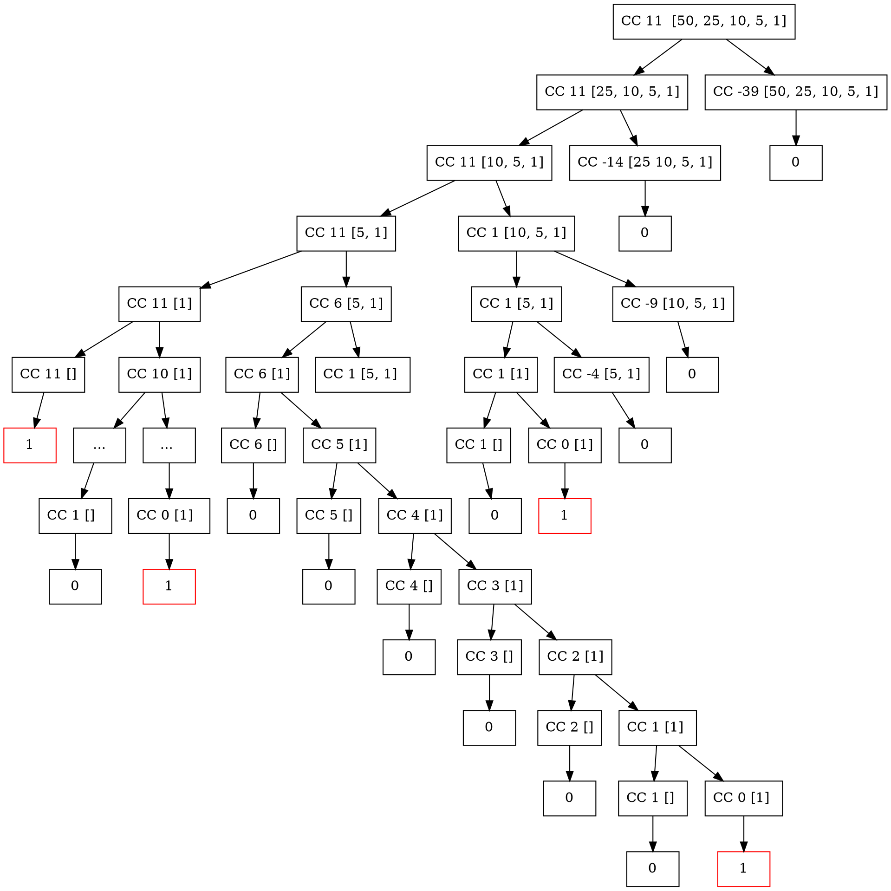

# Exercise 1.14

## Question

Draw the tree illustrating the process generated by the count-change procedure of Section 1.2.2 in making change for 11 cents. What are the orders of growth of the space and number of steps used by this process as the amount to be changed increases?

## Solution

Using the Graphviz framework (is that what it's called?), I was able to render this call graph for invoking the function with 11 cents

For its space complexity, we know that for tree recursive processes the space complexity is roughly proportional to the maximum depth of the resulting tree created when the process is visualized.

In this case, we know that the maximum depth would equal the longest chain/subtree, which would occur from deductions on the original amount using the smallest denomination. As to why this is the case, I don't really have a compelling answer, this kinda just makes sense vOv. For instance, deducting pennies, one at a time, from a 100 cents would definitely lead to a longer call graph than deducting either cents or quarters from the same amount.

Thinking along these lines, I think we can further generalize this thought to say that the maximum depth in this case would be proportional to the original amount divided by the smallest denomination. If we consider the original amount to be $n$ and the "smallest denomination" to be some constant value (since it won't change or need to be computed during the lifetime of the process) $a$, we could say that the space complexity would be roughly proportional to $n/a$ which simplifies to just $n$ for our purposes.

Thus we can conclude that the space complexity for this algorithm is linear $O(n)$

As for the time complexity more investigation is needed. I find that the best way to investigate would be to graph the `count-change` function with a strategic set of inputs (amounts, and tokens)
